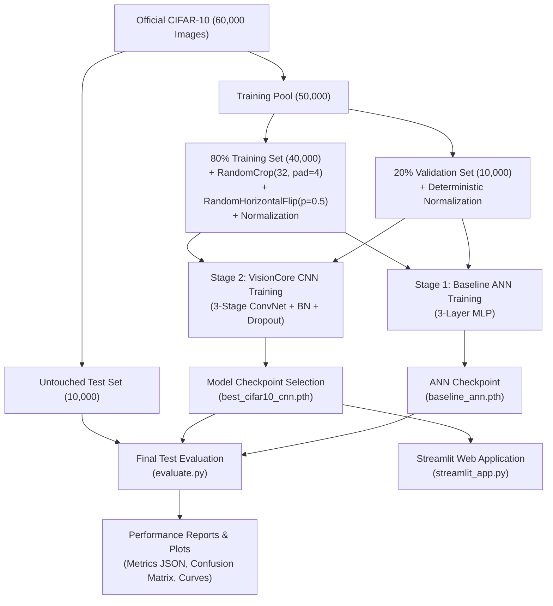

# VisionCore: CIFAR-10 Image Classification using Convolutional Neural Networks (CNN)
### *A Production-Grade, PyTorch-Powered Computer Vision Classification System*

[](https://pytorch.org/)
[](https://pytorch.org/)
[](https://streamlit.io/)
[](https://scikit-learn.org/)
[](LICENSE)

---

## 📌 1. Project Overview

**VisionCore** is an end-to-end, production-quality Computer Vision project that classifies small RGB images into one of 10 distinct object categories from the **CIFAR-10** benchmark dataset. Built entirely with **PyTorch** and **Torchvision** (strictly avoiding TensorFlow/Keras), the system establishes an empirical performance benchmark by comparing a 3-layer Fully Connected Neural Network (**Baseline ANN**) against a 3-stage Deep Convolutional Neural Network (**VisionCore CNN**).

The project demonstrates the entire machine learning lifecycle:
$$\text{Dataset Ingestion} \longrightarrow \text{Exploration} \longrightarrow \text{Normalization \& Augmentation} \longrightarrow \text{ANN Baseline} \longrightarrow \text{CNN Architecture} \longrightarrow \text{Training \& Validation} \longrightarrow \text{Evaluation} \longrightarrow \text{Streamlit Deployment}$$

---

## 🎯 2. Problem Statement

Given a low-resolution color image of dimension $32 \times 32 \times 3$, determine the ground-truth visual category $y \in \{0, 1, \dots, 9\}$. 

The challenge lies in:
1. **Low Spatial Resolution:** Capturing discriminative visual cues from only 1,024 pixels per color channel.
2. **Intra-class Variance:** Distinguishing between visually similar classes (e.g., cats vs. dogs, trucks vs. automobiles) under varied lighting, poses, and backgrounds.

---

## 📊 3. Dataset Characteristics (CIFAR-10)

The dataset is automatically downloaded and managed using `torchvision.datasets.CIFAR10`:

* **Total Samples:** 60,000 $32 \times 32$ color (RGB) images
* **Official Training Split:** 50,000 images $\to$ Split into **40,000 Training (80%)** and **10,000 Validation (20%)** using a fixed random seed (`42`).
* **Official Test Split:** **10,000 images (Untouched)** reserved exclusively for final generalization benchmarking.
* **Channels:** 3 (Red, Green, Blue) $\to$ Shape: $(3, 32, 32)$ in PyTorch Tensor format.

### Target Categories

| Index | Class | Emoji | Description |
| :---: | :--- | :---: | :--- |
| `0` | **Airplane** | ✈️ | Commercial jets, propeller planes, biplanes |
| `1` | **Automobile** | 🚗 | Sedans, race cars, consumer passenger vehicles |
| `2` | **Bird** | 🐦 | Flying birds, perched birds, waterfowl |
| `3` | **Cat** | 🐱 | Domestic felines, kittens |
| `4` | **Deer** | 🦌 | Stags, does, fawns in natural habitats |
| `5` | **Dog** | 🐶 | Canines of various breeds |
| `6` | **Frog** | 🐸 | Amphibians, tree frogs, toads |
| `7` | **Horse** | 🐴 | Equines, galloping/standing horses |
| `8` | **Ship** | 🚢 | Cargo ships, boats, sailboats, yachts |
| `9` | **Truck** | 🚚 | Heavy transport trucks, pickups, trailers |

---

## 🛠️ 4. Technology Stack

* **Language:** Python 3.10+
* **Deep Learning Framework:** PyTorch (`torch`), Torchvision (`torchvision`)
* **Numerical & Data Processing:** NumPy, Pandas
* **Visualization & Analytics:** Matplotlib, Seaborn
* **Metrics & Evaluation:** Scikit-learn (`classification_report`, `confusion_matrix`, `f1_score`, `precision_score`, `recall_score`)
* **Image Processing:** Pillow (PIL)
* **Web UI & Serving:** Streamlit
* **Progress Diagnostics:** tqdm

---

## 🏗️ 5. Project Directory Structure

```text
cifar10-cnn-classifier/
├── app/
│   └── streamlit_app.py           # Interactive Streamlit Web Application
├── data/
│   └── .gitkeep                   # CIFAR-10 auto-download cache directory
├── models/
│   ├── baseline_ann.pth           # Saved baseline ANN PyTorch checkpoint
│   └── best_cifar10_cnn.pth       # Saved best VisionCore CNN PyTorch checkpoint
├── notebooks/
│   └── cifar10_exploration.ipynb  # Interactive dataset inspection notebook
├── outputs/
│   ├── metrics/
│   │   ├── classification_report.txt  # 10-class scikit-learn metrics report
│   │   ├── metrics.json               # Full evaluation JSON payload
│   │   └── model_comparison.csv       # ANN vs. CNN empirical benchmark table
│   └── plots/
│       ├── accuracy_curve.png         # Train vs. Val accuracy across epochs
│       ├── class_distribution.png     # CIFAR-10 class balance histogram
│       ├── confusion_matrix.png       # Test set raw confusion matrix
│       ├── correct_predictions.png    # Sample correct inferences grid
│       ├── incorrect_predictions.png  # Sample misclassifications grid
│       ├── loss_curve.png             # Train vs. Val CrossEntropy loss curve
│       ├── model_comparison.png       # ANN vs. CNN comparison chart
│       ├── normalized_confusion_matrix.png # Recall-normalized confusion matrix
│       └── sample_exploration_grid.png     # 5x5 dataset exploration grid
├── src/
│   ├── __init__.py                # Package initialization
│   ├── config.py                  # Global hyperparameters, paths, and device setup
│   ├── dataset.py                 # Transforms, 80/20 train/val split, DataLoaders
│   ├── evaluate.py                # Test set evaluation, metrics, and matrices
│   ├── model.py                   # BaselineANN and VisionCoreCNN architectures
│   ├── predict.py                 # Predictor engine for single images & Top-K
│   ├── train.py                   # PyTorch training loops with checkpointing
│   └── utils.py                   # Plotting, seeding, conversions, serialization
├── .gitignore                     # Git exclusion rules
├── README.md                      # Comprehensive project documentation
├── requirements.txt               # Strict PyTorch-only dependencies
└── run.py                         # Master CLI orchestrator
```

---

## 🧩 6. Pipeline Architecture



---

## 🔬 7. Neural Network Architectures

### 1. Baseline ANN Architecture (`BaselineANN`)
* **Input:** $3 \times 32 \times 32$ tensor flattened to a 1D vector of $3,072$ scalar features.
* **Hidden Layer 1:** $\text{Linear}(3072 \to 1024) \to \text{BatchNorm1d} \to \text{ReLU} \to \text{Dropout}(0.2)$
* **Hidden Layer 2:** $\text{Linear}(1024 \to 512) \to \text{BatchNorm1d} \to \text{ReLU} \to \text{Dropout}(0.2)$
* **Output Layer:** $\text{Linear}(512 \to 10)$ raw unnormalized logits.
* **Total Parameters:** $\approx 3,674,122$ parameters.

### 2. VisionCore CNN Architecture (`VisionCoreCNN`)
Designed for hierarchical feature learning:

```text
Input Image (3 × 32 × 32)
  │
  ├── [Conv Block 1]
  │     ├── Conv2d(3 → 32, kernel=3, padding=1) + BatchNorm2d(32) + ReLU
  │     ├── Conv2d(32 → 32, kernel=3, padding=1) + BatchNorm2d(32) + ReLU
  │     ├── MaxPool2d(2 × 2)  ──► Spatial Size: (32, 16, 16)
  │     └── Dropout2d(p=0.25)
  │
  ├── [Conv Block 2]
  │     ├── Conv2d(32 → 64, kernel=3, padding=1) + BatchNorm2d(64) + ReLU
  │     ├── Conv2d(64 → 64, kernel=3, padding=1) + BatchNorm2d(64) + ReLU
  │     ├── MaxPool2d(2 × 2)  ──► Spatial Size: (64, 8, 8)
  │     └── Dropout2d(p=0.25)
  │
  ├── [Conv Block 3]
  │     ├── Conv2d(64 → 128, kernel=3, padding=1) + BatchNorm2d(128) + ReLU
  │     ├── MaxPool2d(2 × 2)  ──► Spatial Size: (128, 4, 4)
  │     └── Dropout2d(p=0.25)
  │
  └── [Dense Classifier]
        ├── Flatten ──► 128 × 4 × 4 = 2,048 Features
        ├── Linear(2048 → 512) + BatchNorm1d(512) + ReLU
        ├── Dropout(p=0.50)
        └── Linear(512 → 10) ──► 10 Output Logits
```
* **Total Parameters:** $\approx 1,196,522$ parameters (~$67\%$ fewer parameters than the baseline ANN, yet substantially higher visual capacity).

---

## 💡 8. Why CNNs Excel for Image Classification

1. **Preservation of 2D Spatial Topology:** Fully connected ANNs flatten 2D image matrices into 1D arrays, discarding vertical adjacency and proximity relationships. CNNs maintain spatial dimensions $(C, H, W)$ throughout convolution stages.
2. **Local Receptive Fields & Spatial Locality:** Natural images exhibit high correlation among nearby pixels. A $3 \times 3$ convolutional kernel detects local patterns (edges, corners) across local neighborhoods.
3. **Weight Sharing (Parameter Efficiency):** A single $3 \times 3$ kernel scans the entire image plane using the same set of 9 weights, reducing parameter count exponentially and providing translational invariance.
4. **Hierarchical Feature Composition:** Early convolutional layers extract low-level primitives (edges, color gradients). Intermediate layers combine these into textures and contours. Deep layers recognize semantic entity components (eyes, wheels, wings).
5. **Translation Invariance via Pooling:** Max Pooling ($2 \times 2$) downsamples spatial dimensions, making feature detection robust to minor object shifts, rotations, or scale variations.

---

## 📈 9. Empirical Results & Performance Benchmark

Both models were trained using **Adam** optimizer ($\text{lr}=10^{-3}$, $\text{weight\_decay}=10^{-4}$) with **CrossEntropyLoss** on the exact same 80/20 train/validation split and evaluated on the untouched 10,000-image test set.

### Architecture Comparison Table

| Metric | Baseline ANN (MLP) | VisionCore CNN | Absolute Gain |
| :--- | :---: | :---: | :---: |
| **Parameters** | 3,674,122 | **1,196,522** | **-67.4% (More Efficient)** |
| **Training Accuracy** | 44.47% | **69.39%** | **+24.92%** |
| **Validation Accuracy** | 50.44% | **78.67%** | **+28.23%** |
| **Test Accuracy** | 50.22% | **78.71%** | **+28.49%** |
| **Macro Precision** | 49.80% | **78.80%** | **+29.00%** |
| **Macro Recall** | 50.22% | **78.71%** | **+28.49%** |
| **Macro F1-Score** | 49.34% | **78.49%** | **+29.15%** |

### Per-Class Test Set Performance (VisionCore CNN)

| Class | Total Samples | Correct Predictions | Precision | Recall (Accuracy) | F1-Score |
| :--- | :---: | :---: | :---: | :---: | :---: |
| ✈️ **Airplane** | 1,000 | 831 | 0.7937 | **83.10%** | 0.8119 |
| 🚗 **Automobile** | 1,000 | 937 | 0.8798 | **93.70%** | 0.9075 |
| 🐦 **Bird** | 1,000 | 598 | 0.7494 | **59.80%** | 0.6652 |
| 🐱 **Cat** | 1,000 | 574 | 0.6392 | **57.40%** | 0.6048 |
| 🦌 **Deer** | 1,000 | 751 | 0.7889 | **75.10%** | 0.7695 |
| 🐶 **Dog** | 1,000 | 730 | 0.6784 | **73.00%** | 0.7033 |
| 🐸 **Frog** | 1,000 | 898 | 0.7082 | **89.80%** | 0.7919 |
| 🐴 **Horse** | 1,000 | 787 | 0.8629 | **78.70%** | 0.8232 |
| 🚢 **Ship** | 1,000 | 885 | 0.8948 | **88.50%** | 0.8899 |
| 🚚 **Truck** | 1,000 | 880 | 0.8844 | **88.00%** | 0.8822 |
| **Overall Macro Avg** | **10,000** | **7,871** | **0.7880** | **78.71%** | **0.7849** |

---

## 🎨 10. Visual Diagnostics & Outputs

All generated evaluation plots are automatically stored in `outputs/plots/`:

1. **`loss_curve.png` & `accuracy_curve.png`:** Monitored loss and accuracy progression across training and validation splits.
2. **`confusion_matrix.png` & `normalized_confusion_matrix.png`:** Complete inter-class confusion distribution heatmaps.
3. **`correct_predictions.png`:** Visual grid of correctly classified test images annotated with prediction confidence.
4. **`incorrect_predictions.png`:** Visual grid of misclassifications, identifying difficult cases (e.g., distinguishing domestic cats from small dogs).
5. **`model_comparison.png`:** Side-by-side empirical performance bar chart comparing ANN vs. CNN.

---

## ⚠️ 11. Important Domain Limitation

> **Important Notice:**
> The model is trained strictly on **$32 \times 32$ pixel CIFAR-10 images**. When real-world high-resolution photos are uploaded, they are automatically downscaled to $32 \times 32$. If the input image contains fine-grained textures or backgrounds unseen in CIFAR-10, performance may vary compared to standard benchmark evaluation.

---

## 🚀 12. Quick Start & Execution Guide

### Step 1: Environment Setup
```bash
# Clone the repository and enter directory
cd cifar10-cnn-classifier

# Create and activate virtual environment
python -m venv venv
# On Windows PowerShell:
.\venv\Scripts\Activate.ps1
# On Linux/macOS:
source venv/bin/activate

# Install dependencies
pip install -r requirements.txt
```

### Step 2: Run Master Pipeline
You can run any phase through the unified `run.py` CLI:

```bash
# Execute the full pipeline (Exploration -> Train ANN -> Train CNN -> Evaluate -> Generate Plots)
python run.py --mode full

# Or run individual modules:
python run.py --mode explore     # Dataset inspection & sample plots
python run.py --mode train-ann   # Train baseline ANN only
python run.py --mode train       # Train VisionCore CNN only
python run.py --mode eval        # Evaluate checkpoints on test set
```

### Step 3: Launch VisioNex Web Platforms
You have two distinct, fully-featured user interfaces:

#### Option A: Launch Modern React Frontend (Vite + Tailwind + Recharts)
```bash
# Terminal 1: Launch PyTorch FastAPI Backend
python run.py --mode api

# Terminal 2: Launch Vite React Frontend
python run.py --mode frontend
```
Visit `http://localhost:5173` for the full SaaS dashboard with dark mode, interactive layer visualizer, and Recharts analytics.

#### Option B: Launch Streamlit Web App
```bash
python run.py --mode app
# Or directly via streamlit:
streamlit run app/streamlit_app.py
```
Visit `http://localhost:8501` for the standalone Streamlit interface.

---

## 🎓 13. Technical Interview Q&A Guide

### Q1: What is CIFAR-10?
**Answer:** CIFAR-10 is an established computer vision benchmark consisting of 60,000 $32 \times 32$ RGB images across 10 mutually exclusive classes (6,000 images/class). It is split into 50,000 training and 10,000 test images.

### Q2: Why is image normalization needed?
**Answer:** Pixel values natively range between $[0, 255]$. Dividing by 255 scales them to $[0, 1]$, and subtracting the per-channel mean ($\mu = [0.4914, 0.4822, 0.4465]$) and dividing by standard deviation ($\sigma = [0.2470, 0.2435, 0.2616]$) centers the input distribution with zero mean and unit variance. This prevents vanishing/exploding gradients and speeds up gradient descent convergence.

### Q3: Why is CNN preferable to ANN for computer vision?
**Answer:** ANNs require flattening 2D images into 1D vectors, destroying spatial adjacency. CNNs preserve 2D topology, utilize weight sharing (drastically reducing parameters), and capture hierarchical visual features with translation invariance.

### Q4: What does a 2D convolution operation do?
**Answer:** A convolution computes the cross-correlation between an input feature map and a learnable kernel filter. As the kernel slides across spatial coordinates $(x, y)$, it computes element-wise dot products followed by a summation, producing an activation map highlighting visual patterns.

### Q5: What is a kernel/filter?
**Answer:** A kernel is a small matrix of learnable weights (e.g., $3 \times 3$). Its weights are optimized via backpropagation to detect specific visual features such as horizontal edges, diagonal lines, textures, or color contrasts.

### Q6: Why is ReLU activation used?
**Answer:** The Rectified Linear Unit ($\text{ReLU}(x) = \max(0, x)$) introduces non-linearity without saturating for positive activations, mitigating the vanishing gradient problem inherent in sigmoid and tanh activations while ensuring computationally efficient forward/backward passes.

### Q7: Why is MaxPooling used?
**Answer:** Max Pooling ($2 \times 2$, stride 2) extracts the maximum value within non-overlapping windows. It halves spatial dimensions, reduces memory and computational cost, increases the effective receptive field of subsequent layers, and introduces translation invariance.

### Q8: Why is Dropout used?
**Answer:** Dropout randomly zeros a fraction of neuron activations (e.g., $p=0.25$ or $0.5$) during training. This prevents neurons from co-adapting and forces the network to learn redundant, robust feature representations, mitigating overfitting.

### Q9: What does CrossEntropyLoss do in PyTorch?
**Answer:** PyTorch's `nn.CrossEntropyLoss()` combines `nn.LogSoftmax()` and `nn.NLLLoss()` into a single numerically stable function:
$$\mathcal{L} = -\sum_{i=1}^{C} y_i \log\left(\frac{e^{z_i}}{\sum_{j=1}^C e^{z_j}}\right)$$
It takes raw unnormalized logits directly from the final layer without needing manual Softmax.

### Q10: Why is Softmax applied during inference?
**Answer:** During inference, raw model logits $z \in \mathbb{R}^{10}$ are unconstrained real numbers. Softmax transforms them into a valid probability distribution where each value $p_i \in (0, 1)$ and $\sum p_i = 1$, enabling confidence estimation.

### Q11: How does `torch.argmax()` determine the predicted class?
**Answer:** `torch.argmax(probs, dim=1)` scans the output probability tensor along class dimensions and returns the integer index corresponding to the highest probability value ($\hat{y} = \arg\max_k p_k$).

### Q12: How are Precision, Recall, and F1-Score computed?
**Answer:** 
* $\text{Precision} = \frac{TP}{TP + FP}$ (Of all predicted positives, how many are true?)
* $\text{Recall} = \frac{TP}{TP + FN}$ (Of all actual positives, how many did we capture?)
* $\text{F1-Score} = 2 \times \frac{\text{Precision} \times \text{Recall}}{\text{Precision} + \text{Recall}}$ (Harmonic mean balancing precision and recall).

### Q13: How do you interpret a Confusion Matrix?
**Answer:** The rows represent ground-truth classes, while columns represent model predictions. Diagonal entries ($C_{i,i}$) represent correct classifications ($TP$). Off-diagonal entries indicate specific confusion patterns (e.g., classifying a cat as a dog due to shared quadruped facial features).

### Q14: How is the model checkpointed and loaded?
**Answer:** In PyTorch, model parameters are stored via `model.state_dict()`. Checkpoints are serialized to disk using `torch.save({'model_state_dict': model.state_dict(), ...}, filepath)` and reloaded via `model.load_state_dict(torch.load(filepath, map_location=device)['model_state_dict'])`.

### Q15: How does the Streamlit application perform real-time inference?
**Answer:** When an image is uploaded or selected, `VisionCorePredictor` opens it via PIL, converts to RGB, resizes to $32 \times 32$, normalizes with CIFAR-10 stats, passes the resulting $(1, 3, 32, 32)$ tensor through the CNN in `torch.no_grad()` mode, computes Softmax probabilities, and displays the top predictions alongside an interactive bar chart.

---

## 🔮 14. Future Improvements

* **Advanced Architectures:** Implementing ResNet-18/50 with residual skip connections or MobileNetV3 for edge deployment.
* **Transfer Learning:** Fine-tuning ImageNet pre-trained backbones for higher resolution classification.
* **Explainability (Grad-CAM):** Integrating Gradient-weighted Class Activation Mapping to visualize which image regions activate specific predictions.
* **Test-Time Augmentation (TTA):** Averaging predictions over multiple augmented views to boost test accuracy.

---

## 📄 License
This project is licensed under the MIT License — see the [LICENSE](LICENSE) file for details.
